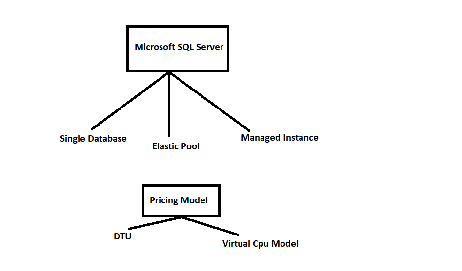

# Databases

## Databases in Non Cloud Areas
### Creation

1. Pickup a server/environment
2. install database server
3. import data into database

### Maintenance:
1. Periodic Backups
2. Making your database highly available By replicating databases and failover when necessary
3. slow responses => Tuning

## Benifits of Cloud Database

### Creational Benifits
1 & 2 will be done by cloud.
3 is what you do

### Maintenance
1,2 & 3 (partially  on some database servers)

3 should be done 

### What is supported?
1. Microsoft SQL Server
2. mySQL
3. Postgres

#### Are all versions of the above are supported?
No

### What happens to non supported Database Engines
1. Market Place Image:
    - Automate creational administration 
    - Maintenance cannot be
2. Build your own VM:

### Pricing & Tier Selection

