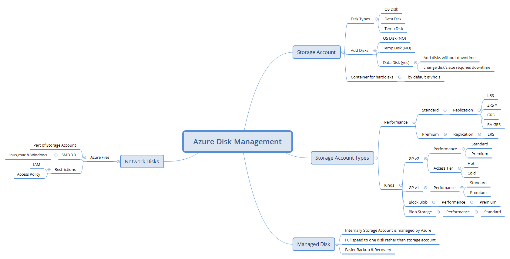

# Harddisks in Azure

## Possible Ways
* Storage Account
    * Steps:
        1. Create a resource group
        2. Create a storage account
        3. Create a vm & in disks section select storage account
        4. Install Storage Explorer from [here](https://azure.microsoft.com/en-us/features/storage-explorer/)
    * How Storage Account Organises data
        * Storage Account
            * Container
                * Blob's
        

* Managed Disk

## Disk Management MindMap
